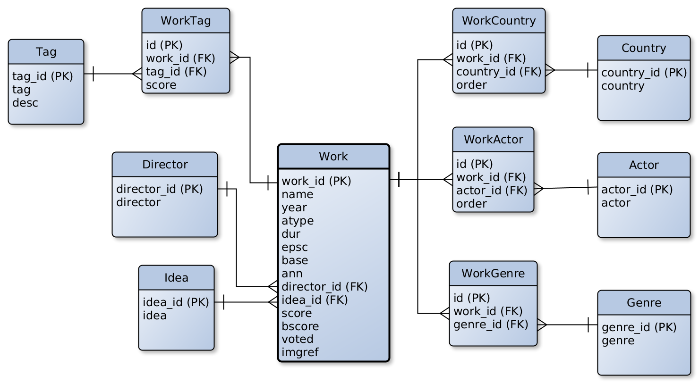
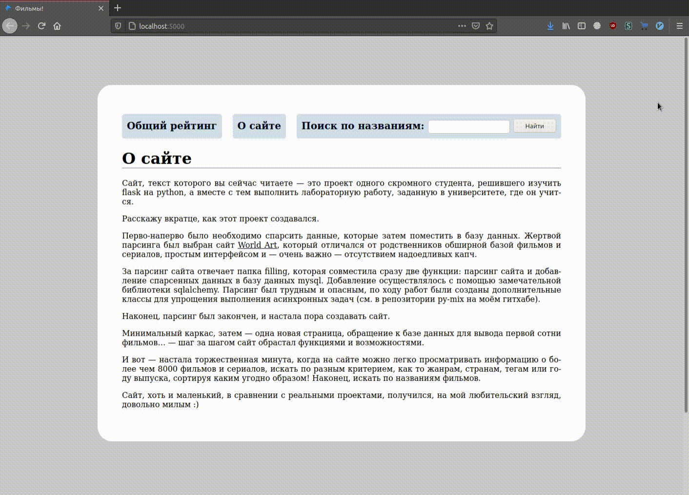
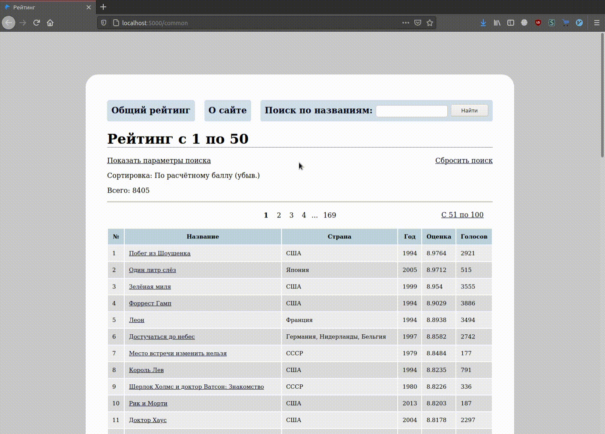
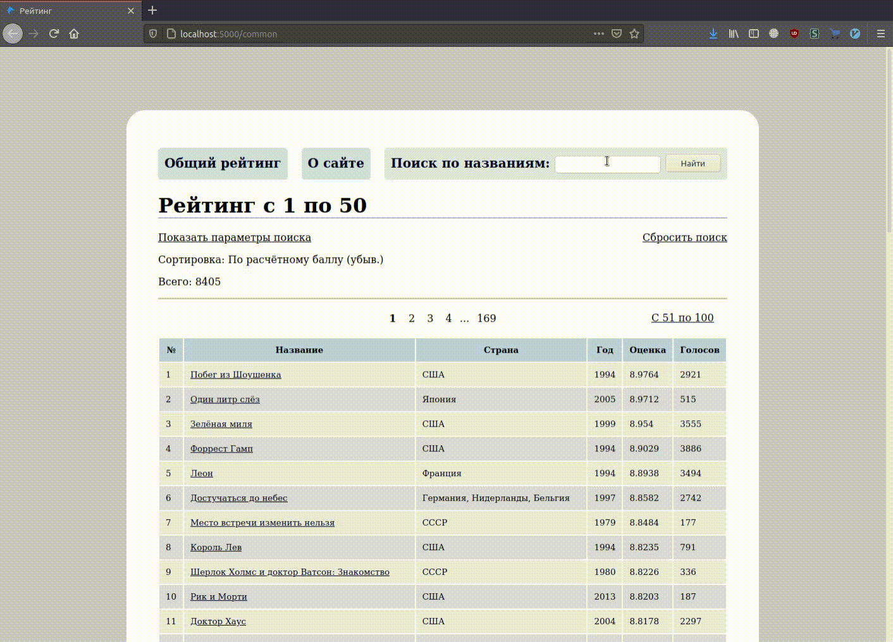

# База данных по фильмам

Данный репозиторий — это проект одного скромного студента, решившего
изучить flask на python, а вместе с тем выполнить лабораторную
работу, заданную в университете, где он учится.

Расскажу вкратце, как этот проект создавался.

Перво-наперво было необходимо спарсить данные, которые затем
поместить в базу данных. Жертвой парсинга был выбран сайт
[World Art](http://www.world-art.ru), который отличался
от родственников обширной базой фильмов и сериалов, простым
интерфейсом и — очень важно — отсутствием надоедливых капч.

За парсинг сайта отвечает папка filling, которая совместила сразу
две функции: парсинг сайта и добавление спарсенных данных в базу
данных mysql. Добавление осуществлялось с помощью замечательной
библиотеки sqlalchemy. Парсинг был трудным и опасным, по ходу работ
были созданы дополнительные классы для упрощения выполнения
асинхронных задач (см. в репозитории py-mix на моём гитхабе).

Наконец, парсинг был закончен, и настала пора создавать сайт.

Минимальный каркас, затем — одна новая страница, обращение к базе
данных для вывода первой сотни фильмов… — шаг за шагом сайт обрастал
функциями и возможностями.

И вот — настала торжественная минута, когда на сайте можно легко
просматривать информацию о более чем 8000 фильмов и сериалов, искать
по разным критерием, как то жанрам, странам, тегам или году выпуска,
сортируя каким угодно образом! Наконец, искать по названиям фильмов.

Сайт, хоть и маленький, в сравнении с реальными проектами,
получился, на мой любительский взгляд, довольно милым :)

### База данных

Структура базы данных:

### Демонстрация сайта

«О сайте» и общий рейтинг.

Переход между страницами рейтинга.

Поиск по типу: только сериалы.

Поиск по жанру: исторические фильмы и сериалы

Поиск всех произведений от 1915 до 1990, 200 произведений на одной
странице

Просмотр информации по отдельным фильмам

Поиск определённых фильмов через нажатие на соответствующую ссылку
на странице произведения

Поиск фильмов по названию

